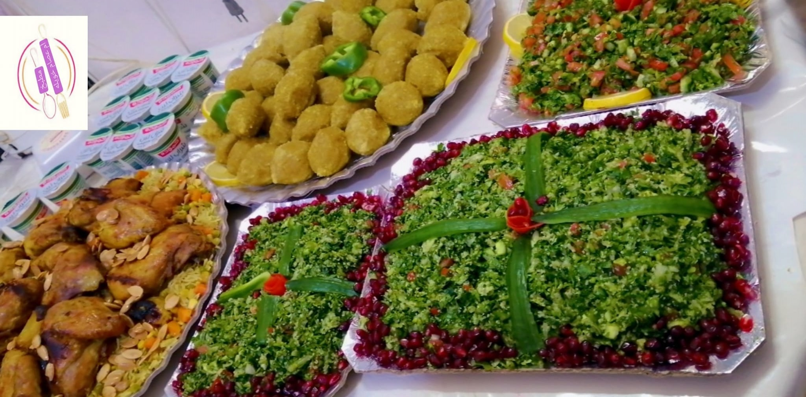
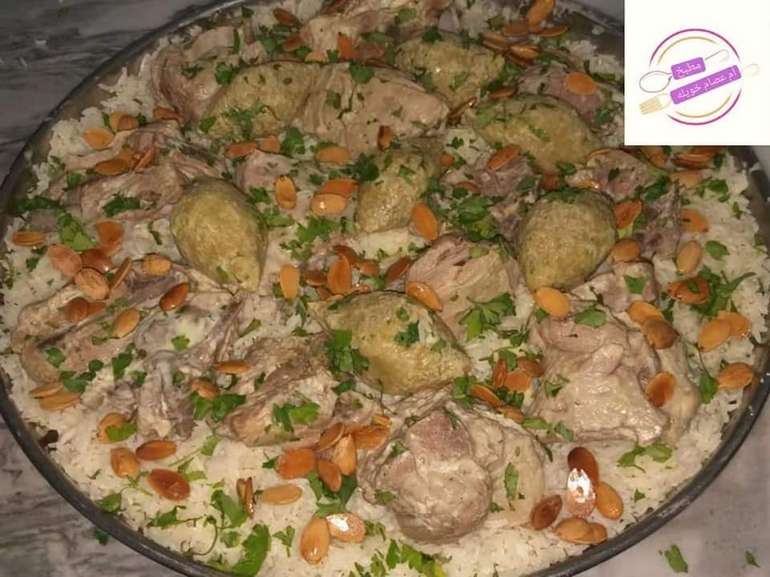
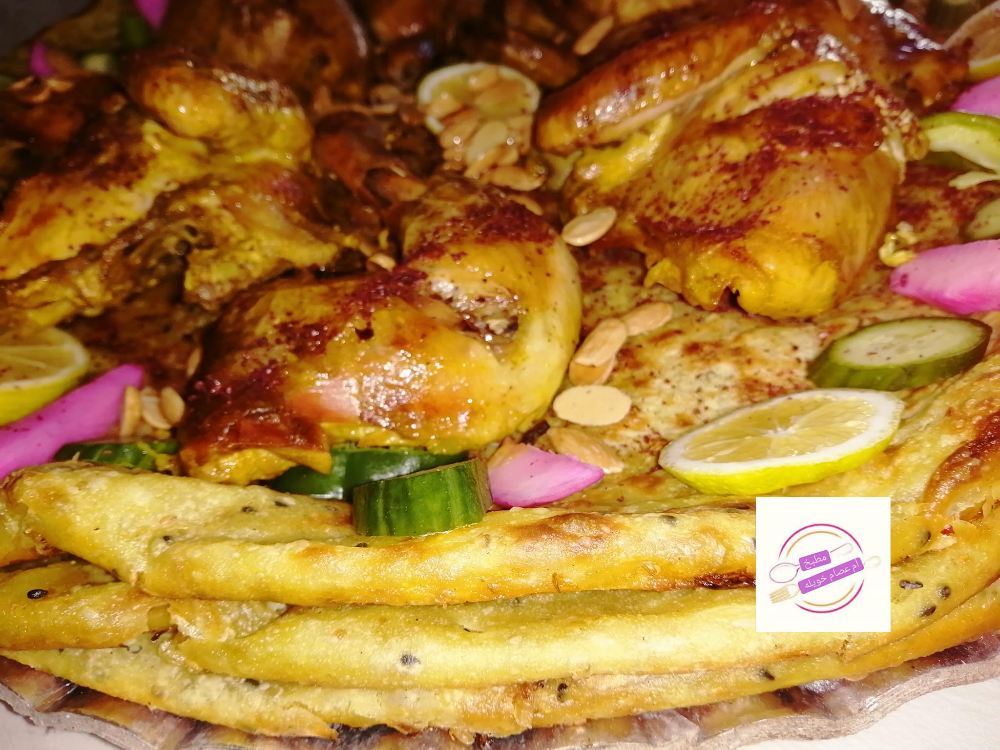
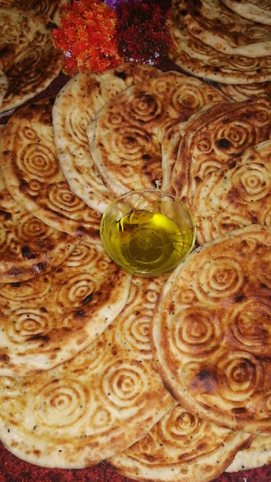

# my-resturant
Jordanian Food
**Jordan's Popular Food**

## Each country is distinguished from the others by popular dishes prepared by ancestors since ancient times, and it has been passed down from generation to generation, but Jordan has a special taste.
  

## Our dishes: 
- Mansaf  

- Kabseh 
 

- Fataier 

- Bread with onion       
- Eid Bread 
- Dawali 
- Kbab  

:phone: Contact us +962780604948

:clock1: available 8:00 am - 10:00 pm

 🔗 [Jordanian Food](https://web.facebook.com/%D9%85%D8%B7%D8%A8%D8%AE-%D8%A7%D9%85-%D8%B9%D8%B5%D8%A7%D9%85-%D8%AE%D9%88%D9%8A%D9%84%D8%A9-101776451815074)

